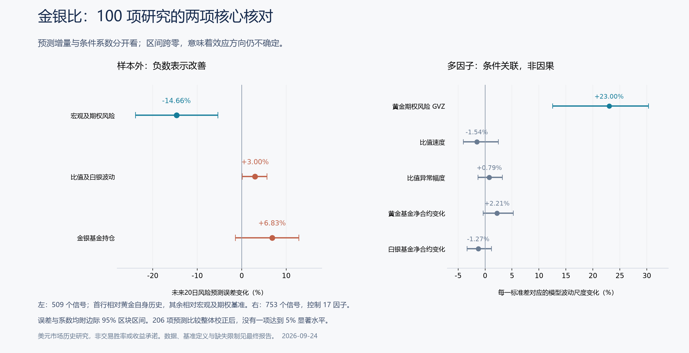

# 金银比综合研究报告

研究截至北京时间 2026 年 9 月 24 日。本报告合并初步研究、第二阶段、三轮循环、100 项研究和期限应用，是本专题唯一的权威叙事入口。范围为国际美元金银市场的一般规律，不限定投资产品与持有期。早期报告保留在根目录 `archive/2026-09-24-gold-silver-study/`，仅用于追溯研究演进。

已完成 **100 个预先列明的研究单元**，涵盖公式与机制、测量、长期关系、宏观、风险、日内先后、基金、文献与多因子验证。它们不是 100 个独立样本，也不意味着所有问题都得到肯定答案。完整问题、证据、反证和限制见[100 项台账](hundred/100项研究台账.md)。

**核心判断：金银比适合辅助解释金银相对强弱、风险状态和市场分化；目前没有足够稳健的证据，把它单独升级为黄金涨跌预测器，或用它识别“主力决定”发生的先后及因果。**

这里的“不足”限定于可取得数据和已检验模型。确有研究在更长的日内期货样本中发现风险预测增量；本次保留这条正面证据，没有把自己的弱结果夸大成“金银比永远无用”。

**一、可以确定的结论**

设 G、S 为同一时刻、同一计价单位的金银价格，R=G/S，则：

Δln R = Δln G − Δln S。

1. 比值升高只确定黄金相对白银更强。黄金涨、白银跌可以使比值升高；黄金跌 1%、白银跌 3% 也可以。比值回落也可能由白银上涨完成，不要求黄金下跌。
2. 比值是两种价格的函数。共同计价货币换算在算式中抵消，但美元冲击对金银反应不同，仍可以改变相对价格。
3. 比值水平、变化方向、变化幅度和加速度回答不同问题。相同 5 点变动，从 40 起步是 12.5%，从 100 起步是 5%。讨论“速度”应使用百分比、对数变化或相对历史波动的异常程度。
4. 期货全市场多空合约总量相等；某一类别增加净多，必有其他类别合计增加相应净空。净持仓不是全市场净流入资金，也不是交易者的完整决定。某类别净多占比下降甚至可能只是未平仓量分母增加。
5. 同期关联、统计领先、可实时利用的预测、结构因果，逐层需要更强证据。前一层成立不能代替后一层。

本次分别核对了收益、方差和持仓会计恒等式。1,020 个持仓变化周期中，净多比例变化与净合约变化方向相反，黄金有 95 次、白银有 68 次。将“净多比例下降”直接解释成“主力净卖出”会混入分母效应。

**二、你的第一个问题：白银与比值怎样为黄金投资提供参考？**

可以提供背景和交叉确认，尤其是区分“黄金自身变强”与“白银受到更大压力”。它对相对配置的含义通常比对黄金单边方向更直接。

比值高低受至少五类因素影响：黄金的储备及避险需求；白银的工业、技术与供需变化；美元和实际利率；金银不同的流动性及去杠杆反应；投资者相对配置、持仓和预期。央行购金统计含未披露购买的估计，工业用银也会受节银和替代影响，所以这些因素不能简单归入一个“情绪指数”。[世界黄金协会央行统计](https://www.gold.org/goldhub/research/gold-demand-trends/gold-demand-trends-full-year-2025/central-banks)、[世界白银调查 2026](https://silverinstitute.org/wp-content/uploads/2026/04/World-Silver-Survey-2026.pdf)。

本次同样本宏观回归显示：实际利率上升与金银同期收益均为负关联，但两者的差异区间跨零；铜价上升对白银的正关联较大，比值对铜的条件系数为 **−1.64 个对数收益百分点／一个标准差，95%区间 [−2.32,−0.80]**。这支持“比值包含周期相关信息”，不能证明“铜价冲击因果决定比值”，更不是未来金价预测。

固定比值中枢缺少跨时期稳定性。1972—1989、1990—2006、2007—2016、2017—2025 四段月度中位数依次约为 **39.71、70.72、62.27、82.48**。全样本估计出的均衡或半衰期，不能直接当成永久的买卖阈值。行业报告的均衡估计与近期参数不稳定研究应一起阅读。[Silver Institute 比值报告](https://silverinstitute.org/wp-content/uploads/2026/07/Is-the-Gold-Silver-Ratio-Relevant-Today.pdf)、[CESifo 长期关系研究](https://www.ifo.de/DocDL/cesifo1_wp12559.pdf)。

比值变化会改变两种金属的相对兑换价格、名义对冲比例和组合风险，也可能影响关注相对价值的交易者配置。但“比值本身导致市场如何变化”不能从其价格恒等式识别出来；相对交易与价格之间可能形成反馈。

**三、你的第二个问题：速度／速率怎样反映市场情绪？**

建议先问“哪条价格腿推动了比值”，再看是否有独立市场证据。下表是解释框架，不是本次估计出的机械交易信号。

| 观察到的组合 | 可考虑的解释 | 还需要核对 |
|---|---|---|
| 比值快速上升，金跌、银跌得更多 | 流动性压力、去杠杆或工业风险可能加强 | 美元、VIX、GVZ、成交与买卖价差 |
| 比值上升，金涨而银平或跌 | 黄金特有需求或相对白银的避险偏好可能加强 | 实际利率、黄金资金与白银供需 |
| 比值快速下降，金银同涨且银更强 | 周期预期、风险偏好或白银特有行情 | 铜价、股市及白银供需／仓位 |
| 比值下降，黄金跌得更多 | 黄金特有压力，也可能是不同市场流动性差异 | 黄金价格腿与独立风险指标 |

本次采用 v=过去 5 日 Δln R；加速度代理为 v 与此前 5 日 v 的差；异常幅度用此前 252 个交易日的均值和标准差衡量。若要表达每天速度，可再除以 5。加速度放大也可能来自上一段反向变化和噪声，不能自动解读为情绪升级。

先前轮次的急升事件确实常与同周股市走弱、VIX 上升和白银跌得更多相伴。但这是同期条件描述，部分关系由比值定义直接产生，不是未来涨跌概率，也没有识别出纯粹的“恐慌因子”。

新增日线检验在已有黄金历史、美元、实际利率、美股、VIX、GVZ 后，速度、加速度、绝对幅度、标准化异常、残差异常、正负分项、平方及状态交互均未形成稳健增量。20 日黄金风险的 549 个前推信号中，加速度在速度模型之外使误差约增加 **0.15%**；标准化异常相对强基准增加约 **0.69%**。两者区间都跨零。

研究方向因此更偏向“描述状态和评估风险”，但本次尚未确证这些简单比值特征在已有风险指标之外的稳定预测价值。独立搜索情绪文献也强调日内风险及跳跃通道，不能据此将金银比与搜索情绪直接等同。[Balcilar 等的原研究](https://www.sciencedirect.com/science/article/pii/S0301420716300885)。

**四、你的第三个问题：比值变化和主力资金决定，谁先谁后，有没有因果？**

可以存在双向反馈，但不存在由本次证据支持的固定顺序。共同宏观消息可能同时改变金银价格和基金持仓；价格变化也可能引发追涨、止损、保证金调整和相对交易。每周聚合持仓无法恢复这些盘中路径。

COT 通常在周五美东 15:30 公布周二截至的持仓，并存在节假日、停发追补与修订。本研究使用截至日后 10 天的保守可用时钟，排除较宽的已知异常窗口；这减少前视风险，但不是完整真实发布档案。[CFTC 报告及历史公告](https://www.cftc.gov/MarketReports/CommitmentsofTraders/HistoricalSpecialAnnouncements/index.htm)。

在公开可用时钟下，本次管理基金、生产商、掉期商、其他报告者、跨期套利、相对拥挤和极端头寸没有形成稳定预测增量。同期持仓—价格联系较强，不能据此断言基金先决定、价格后响应。2012 和 2015 年研究总体也强调时期、分类和期限依赖，并保留极端持仓与较长累计期限的例外。[2012 持仓研究](https://www.sciencedirect.com/science/article/pii/S0301420712000086)、[2015 投机研究](https://www.sciencedirect.com/science/article/pii/S0301420715000227)。

小时报价检验中，白银滞后收益加入黄金自身模型，黄金后续收益误差约 **增加 0.115%**；黄金滞后收益加入白银模型，误差约 **下降 0.338%**，但区间跨零。黄金平方收益对白银后续平方收益的点改善约 **5.40%**，95%区间 **[−11.61%,+9.20%]**，仍不能确立领先。同步相关约 0.81 明显比相邻时段相关更突出。

这些结果只涉及所测时段的统计预测。价格发现研究还区分永久信息和暂时报价噪声；任何一种统计领先都不等于已识别单个机构决定或因果。[价格发现原研究](https://papers.ssrn.com/sol3/papers.cfm?abstract_id=5212538)、[CFTC 托管的流动性研究](https://www.cftc.gov/sites/default/files/Open%20Interest%20and%20Liquidity%20CFTC_ada.pdf)。

**五、多因子系数结论**

模型形式为 Y=α+ΣβⱼZⱼ+误差，Z 是标准化因子。完整模型含黄金自身历史 5 项、宏观及期权 5 项、比值／白银风险 3 项、金银基金水平及变化 4 项。拟合用 753 个周信号（2010-09-24—2025-09-26）；留出完整交易日后研究未来 20 日。以下为所关注因子；方括号是边际 95% 区块区间。

| 每增加一个样本标准差 | 未来20日黄金收益，近似百分点 | 模型预测波动尺度，相对% |
|---|---:|---:|
| GVZ 水平（对数） | -1.47 [-2.43, -0.63] | +23.00 [+12.55, +30.31] |
| 美元过去20日变化 | -0.63 [-1.07, -0.17] | -0.21 [-3.24, +3.82] |
| 实际利率过去20日变化 | -0.29 [-0.76, +0.23] | -0.38 [-3.98, +2.73] |
| 比值速度（5日） | +0.10 [-0.26, +0.54] | -1.54 [-4.03, +2.46] |
| 比值异常幅度 | +0.19 [-0.14, +0.56] | +0.79 [-1.29, +3.20] |
| 黄金基金净合约变化 | +0.12 [-0.30, +0.54] | +2.21 [-0.34, +5.27] |
| 白银基金净合约变化 | -0.08 [-0.41, +0.39] | -1.27 [-3.36, +1.21] |

风险列计算 100×[exp(β/2)−1]，表示模型给出的波动尺度相对变化；不是黄金价格涨幅，也不是因子引发的因果效应。比值速度的一标准差约为 5 日 **2.77 个对数收益百分点**。VIX 与 GVZ 不同：GVZ 来自黄金 ETF 期权，直接包含黄金预期风险及风险溢价。[CBOE 产品说明](https://cdn.cboe.com/resources/regulation/circulars/regulatory/RG11-048.pdf)。

在另一个目标——未来比值变化——速度的系数为 **−0.42 个对数收益百分点，95%区间 [−0.97,−0.11]**。这只是样本内相对反转迹象，51 个主系数一起校正后未达到 5%，样本外也未形成稳定改善。不能将它翻译为黄金必涨或白银必跌。

51 个主系数的近似整体校正中，只有 **GVZ 与未来黄金风险的正关联** 保持在 5%以内。完整模型样本内 R²：黄金收益约 **7.3%**、黄金对数方差约 **40.9%**、比值收益约 **6.0%**；这不是三个目标的预测胜率。

完整系数、各因子的标准差、共线性、宏观同期差异和全部主检验见[多因子系数与检验表](hundred/多因子系数与检验表.md)。下图将风险预测增量与风险条件系数并列，二者不能相互替代。

**六、样本外验证与置信度结论**

下表统一使用完整因子组可用的 **509 个前推信号，2015-07-17—2025-09-26**。模型每次只使用该时点已经结束的训练目标。数值是预测均方误差变化，负数才表示改善。

| 增加的信息组 | 黄金未来收益 | 黄金未来对数方差 | 比值未来收益 |
|---|---:|---:|---:|
| 自身历史之外加宏观及期权风险 | −1.15% | −14.66% | +4.12% |
| 宏观基准之外加比值速度、异常幅度及白银波动 | +9.00% | +3.00% | +1.97% |
| 宏观基准之外加金银管理基金水平及变化 | +6.95% | +6.83% | +2.54% |

这说明在所测模型与信息集中，风险比方向更容易解释，新增复杂信息并未必改善预测。不能据表中误差上升证明相应经济渠道不存在；模型形式、估计误差和样本限制都会影响结果。

本次新增全期主比较共 **206 项**。原始 p<0.05 的有 12 项，整体 Holm 校正后 **0 项** 低于 0.05。宏观及期权组的风险改善是正面迹象，但严格全局校正后也不能称为本批次确认的新发现。此前 3 轮结果是相关的补充证据，不与本批次共享数据的结果相加包装成独立重复。

| 判断 | 证据等级 | 这里的含义 |
|---|---|---|
| 比值变化是金银相对收益差，不确定黄金单边方向 | 确定 | 数学恒等式与反例 |
| 固定中枢／阈值不可当成永恒规律 | 较高 | 跨期分布和文献均要求稳定性检验；不是证明所有均值回归模型无效 |
| 比值同时混合金融风险与白银周期／供需信息 | 中等至较高 | 机制、原始行业资料和同期回归相容；各渠道贡献仍未识别 |
| 简单速度、加速度、持仓能稳定预测黄金 | 尚未确立 | 样本外、多基准及多重检验未给出足够支持 |
| 日内异常估值可能增加风险预测信息 | 有正面线索，待复现 | 最新论文支持；本次代理检验短、粗且缺极端日 |
| “主力先动→比值→黄金”的固定因果链 | 无法识别 | 缺个体订单、真实决策与完整信息发布时间 |

这些等级是对证据强弱的判断，不是校准后的“结论正确概率”。95%置信区间也不等于命题有 95%概率为真，或未来收益有 95%概率落入其中。

**七、必须保留的相反证据与数据缺口**

2026 年《Relative Valuation in Precious Metals Markets》使用 2009—2025 年日内期货数据，报告异常估值压力在已有黄金隐含波动率之外仍改善风险预测。这与“比值绝对无用”明显不相容；其对象是未来方差，不是金价方向。本次能核对公开摘要和版本，未获得足够完整的方法与原数据进行严格复现。[论文原始页面](https://papers.ssrn.com/sol3/papers.cfm?abstract_id=7170627)。

本次免费日内代理只有约两年纽约 ETF 时段：501 个日期、493 个完整日；清洗、历史窗口和训练期后，1 日与 5 日风险只剩 156 和 140 个评价信号。**2026-01-30 这个重大暴跌日的小时数据不完整**：日线交叉核对金银跌约 10.27% 和 28.54%。它被保留为缺失，没有冒充低风险；这也使本次日内结果不能覆盖完整的极端压力情景。小时采样会漏掉小时内波动，ETF 也不同于全天 COMEX 期货。

长期月度数据是月均现货价格，2025 年 6 月黄金报价来源变化；短中期主要使用 ETF 相对变化与期货稳健性对照。COT 为汇总周度数据且历史库可能修订。因而本次既没有声明“所有历史信息都完全实时可得”，也没有声明已证实资金因果。

**完成与复核记录**

100 项记录已完成；外部核对覆盖主要可取得研究与官方资料，未宣称穷尽网络上所有研究。独立复核了 29,625 个日线目标值、23,432 个日内目标或组成值、696 次模型重估、206 个误差比较和 117 个系数；已检查预测训练标签的时间边界。[100 项台账](hundred/100项研究台账.md)、[文献核对](hundred/文献核对.md)、[数值复核记录](hundred/verification.json)。

后续真正能提高结论强度的材料，是覆盖极端日期的长期同步分钟级金银期货、精确合约衔接、完整 COT 实际发布时间与历史版本，以及可支持外生冲击识别的数据。继续堆叠相同公开日线指标，不能自动补上这些识别缺口。

## 期限应用（2026-09-24 快照）

期限判断是当时市场状态的应用快照，不是由 100 项研究产生的永久预测。日线截至 2026-09-23：GLD 低于 20 日均线约 2.34%、低于 200 日均线约 5.64%，在 60 日均线上方约 0.44%；美元指数近一个月上涨约 2.33%。因此当时的描述是短期偏弱、中期震荡，半年和一年方向证据不足。

| 未来期限 | 当时倾向 | 金银比的合理用途 | 方向把握 |
|---|---|---|---|
| 1 个月 | 偏弱震荡，警惕反弹后继续回落 | 区分黄金自身压力与白银更弱；急变时配合 GVZ 核查风险 | 中低 |
| 3 个月 | 震荡，等待价格与宏观共同确认 | 检查相对强弱是否持续，不根据一次急升押注黄金反弹 | 低 |
| 6 个月 | 保留双向情景 | 辅助区分工业周期和黄金特有需求 | 低 |
| 12 个月 | 以宏观情景判断 | 用于相对配置与结构变化分析，不用固定比值反推金价 | 低 |

当时用现货参考价 4,249.90 美元/盎司、年化波动 23.59% 和零对数趋势计算中央 80% 的示意带：1 个月 3,890—4,640，3 个月 3,650—4,940，6 个月 3,430—5,260，12 个月 3,140—5,750。它们只反映波动量级，不是估值区间、支撑阻力、期间高低点或经覆盖率验证的概率预测。完整快照与公式保留在[期限与区间分析](outlook-2026-09-24/期限与区间分析.md)。

## 研究演进与留档规则

- 初步研究先排除了“比值方向等于黄金方向”的逻辑错误，并用长期月度数据发现简单择时能力不足。
- 第二阶段加入日线风险、COT 和宏观控制，正面线索主要落在风险而非收益方向。
- 三轮循环加入 GVZ、公布延迟、替代工具和 2026 压力检验，进一步削弱简单速度与持仓信号的稳健性。
- 100 项研究统一复核后，没有发现足以修改黄金基准策略的证据；唯一较稳定的是 GVZ 与未来黄金风险的条件关联。

以上阶段差异已吸收到本报告。协议、台账、系数表、文献核对和机器可读结果继续作为复现材料；阶段报告只归档，不再与本报告并列作为当前结论。
